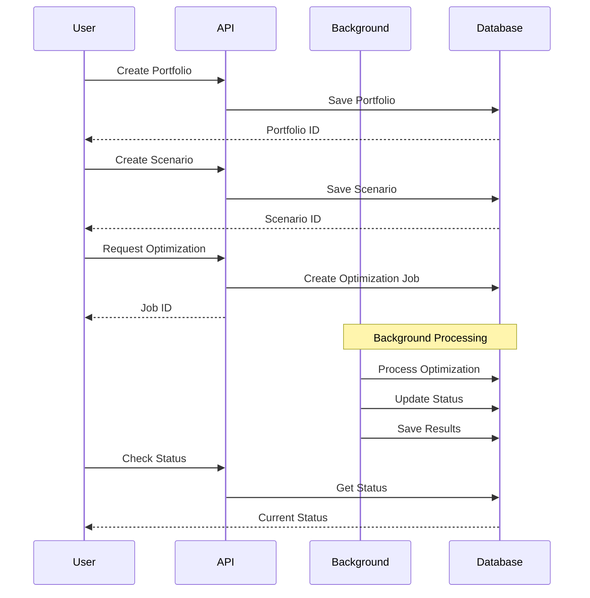

# RMSGAS-2 MOCK REST API

An Express.js based Mock REST API for managing RMS-GAS optimization and portfolio scenarios.

## Features

- Portfolio management
- Scenario management
- Shipper planning
- Optimization processing
- Background task handling
- SQL Server database integration
- Swagger API documentation

## Prerequisites

- Node.js >= 20.x
- SQL Server 2019 or later
- npm >= 10.x
- Git
- Visual Studio Code (recommended)
- Azure Data Studio (recommended for database management)

## Installation

```sh
# Clone the repository
git clone <repository-url>

# Install dependencies
npm install
```

## Configuration

Create a `.env` file in the root directory with the following variables:

```sh
PORT=3000
NODE_ENV=production

# Database Configuration
DB_SERVER=localhost
DB_DATABASE=RMSDB
DB_USER=sa
DB_PASSWORD=your_password123
DB_PORT=1433
DB_ENCRYPT=false
DB_TRUST_SERVER_CERTIFICATE=true
PRODUCTION_URL=https://your-domain.com
```

## Available Scripts

```sh
# Start production server
npm start

# Start development server with hot reload
npm run dev

# Run database migrations
npm run migrate
```

## API Documentation

Swagger documentation is available at `/api-docs` endpoint when the server is running.

### Main Endpoints

- `GET /portfolio` - Get all portfolios
- `GET /scenario` - Get all scenarios
- `GET /optimization` - Get optimizations with filters
- `GET /shipper-planning` - Get shipper planning records
- `GET /check/db/connection` - Test database connection

## Project Structure

```
src/
├── app.js                 # Application entry point
├── config/               # Configuration files
├── controllers/         # Route controllers
├── models/             # Database models
├── routes/            # Express routes
└── services/         # Business logic services
```

## Database Models

- [`PortfolioModel`](src/models/portfolioModel.js) - Portfolio operations
- [`ScenarioModel`](src/models/scenarioModel.js) - Scenario operations
- [`OptimizationModel`](src/models/optimizationModel.js) - Optimization operations
- [`OptResultModel`](src/models/optResultModel.js) - Optimization results
- [`ShipperPlanningModel`](src/models/shipperPlanningModel.js) - Shipper planning

## Optimization Workflow

The optimization process follows these steps:

1. **Create Portfolio** (`POST /portfolio`)
   - Set up portfolio parameters
   - Define constraints and rules

2. **Create Scenario** (`POST /scenario`)
   - Link to portfolio
   - Configure scenario settings

3. **Trigger Optimization** (`POST /optimization`)
   - System executes optimization in background
   - Returns job ID for tracking
   - Uses event emitter for async processing

### Process Flow



### Status Tracking

Optimization status can be monitored through:
- `GET /optimization/{jobId}` - Get specific job status
- `GET /optimization/{jobId}/results` - Get optimization results

## Author

Khairu Aqsara <khairu@teruselearning.co.uk>

## License

ISC
